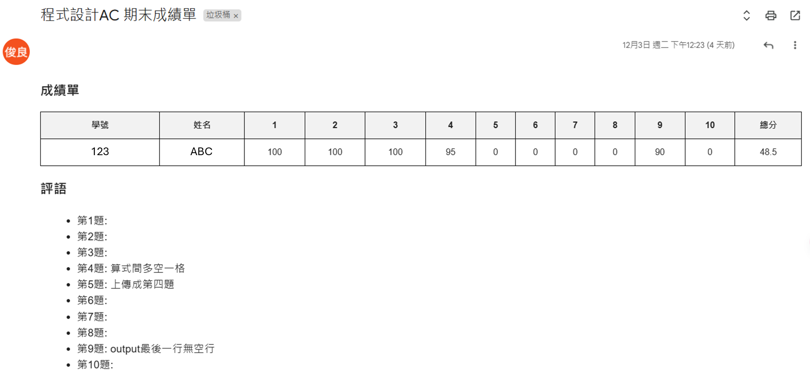

# Notebook Descriptions

## 1. `running_number`
**File Description:**
- Input: A PDF file provided by the user.
- Functionality: Generates a specified number of PDF copies.
- Features: Each generated PDF includes a unique random code.
- Use Case: Suitable for creating personalized or uniquely identified PDF documents.

---

## 2. `auto_email`
**File Description:**
- Input: An Excel file containing:
  - Student IDs.
  - Student names.
  - Score for each question(1~10).
  - Total scores.
- Functionality: Creates personalized grade reports for each student.
- Features:
  - Supports adding annotations directly into the Excel file.
  - Automatically sends the generated grade reports via email to students.
- Use Case: Useful for quickly distributing grades and feedback to students.

---

## 3. `crawler_for_ndhu_e`
**File Description:**
- Input: NDHU eLearning account and password (for login).
- Functionality: Automates the login process to NDHU eLearning, scrapes the .c program files submitted by students, and saves them locally.